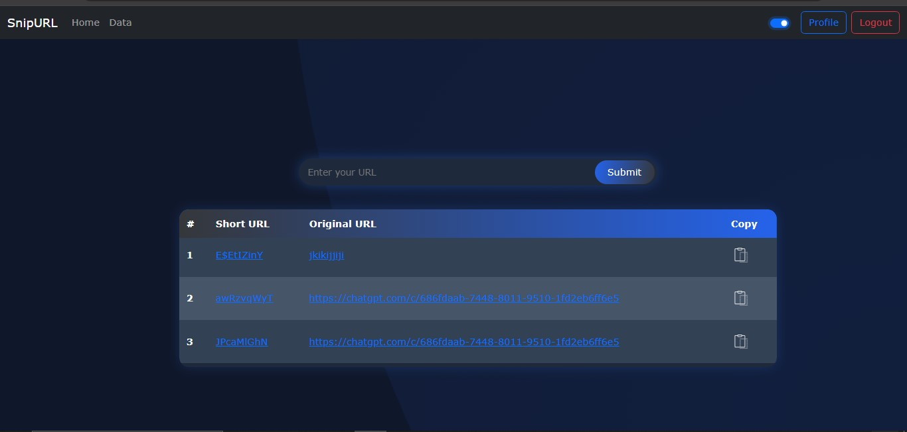

# 🌐 URL Shortener (MERN Stack)

A simple **URL Shortener app** built using the **MERN stack** (MongoDB, Express, React, Node.js) to shorten long URLs, track clicks, and manage your links easily.

---

## 🚀 Features

✅ Shorten long URLs to clean, shareable short links.  
✅ Redirect users to the original URL when they visit the short link.  
✅ Track the number of clicks on each link.  
✅ Clean, minimal React frontend.  
✅ RESTful API backend with Express and Node.js.  
✅ MongoDB for storing URL mappings and click counts.

---

## 🛠️ Tech Stack

- **Frontend:** React,HTML, CSS
- **Backend:** Node.js, Express.js
- **Database:** MongoDB (using Mongoose)
- **Other:** shortid for generating unique short codes

---

## 📸 Screenshots



---

## ⚙️ Installation

### 1️⃣ Clone the Repository

```bash
git clone https://github.com/your-username/URL-Shortner.git
cd URL-Shortner
